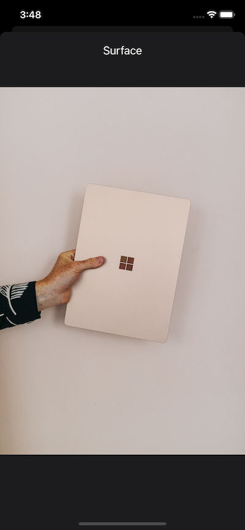

# unsplash

### 개요

- Unsplash Map API를 활용한 지도 정보 앱
- Min iOS ver: 12.0
- Dark mode 지원

### 개발기간

- 3일 ('20. 06. 25. ~ 20.06. 27.)

#### API

- Unsplash Developers : https://unsplash.com/developers

  

### 앱 기능

#### ViewController

- MainViewController

  - 화면 진입시, 상단에 title과 검색할 수 있는 seachBar 가 있다.

  - 입력이 없을 경우, 기본 photo list를 보여준다.

  - 입력이 있을 경우, 실시간으로 photo list 를 갱신해서 보여준다.

  - 하단으로 스크롤할 경우, 다음에 표시될 정보가 로드된다.

  - 이미지를 누를 경우, DetailViewController 로 이동한다.

    

- DetailViewController

  - MainVIewController 에서 선택된 image를 보여준다.

  - 좌우로 스크롤하여 이전, 다음 이미지를 볼 수 있다.
  - 하단으로 내려 해당 화면을 닫을 수 있다.

#### CocoaPods

| 이름         | 설명                                                 |
| ------------ | ---------------------------------------------------- |
| RxSwift      | Functional Programming 을 위한 Swift용 React Library |
| RxCocoa      | UIKit을 RxSwift 처럼 사용하기 위한 Library           |
| Alamofire    | API 통신 Library                                     |
| Kingfisher   | Image load Library                                   |
| SwiftyBeaver | Log 처리용 Library                                   |

### 앱 실행 예시
 
  